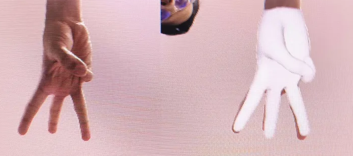

# Hand pose → Task Space Vectors

Extract MANO parameters, 3D joints and Task Space Vectors from RGB images using
[HAMER](https://github.com/geopavlakos/hamer) and
[MediaPipe Hands](https://mediapipe.dev/).



## Pipeline

1. **MediaPipe Hands** finds each hand and its handedness, giving a 2D bounding
   box per hand.
2. **HAMER** takes each crop and regresses a MANO hand: shape and pose
   coefficients, 21 3D joints, and the mesh vertices.
3. **Task Space Vectors** are the palm-to-fingertip displacements of those
   joints — a `(5, 3)` array per hand.

MediaPipe is used only as a detector. HAMER needs a box and a handedness flag,
and MediaPipe supplies both far more cheaply than running a detection
transformer.

## Outputs

Per detected hand, into `--out-folder`:

| file | contents |
|---|---|
| `{image}_{id}_mano.npy` | dict: `global_orient`, `hand_pose`, `betas`, `cam_t`, `is_right` |
| `{image}_{id}_tsv.npy` | `(5, 3)` fingertip vectors relative to the palm |
| `{image}_{id}.obj` | triangulated mesh, only with `--save-mesh` |
| `{image}_overlay.png` | the predicted mesh composited over the input |

## Task Space Vectors

A TSV is the displacement from the wrist joint to each fingertip, giving a
compact `(5, 3)` matrix that describes finger configuration independently of
where the hand is or how it is oriented. The representation is from
[DexMV](https://yzqin.github.io/dexmv/) (Qin et al., CVPR 2022), which uses it
to transfer human hand poses onto dexterous robot hands. `sohand.retarget`
consumes it directly.

## Usage

```bash
python -m sohand.perception.hand_pose \
    --img-folder path/to/images \
    --out-folder poses/ \
    --save-mesh \
    --rescale-factor 2.0
```

| Flag | Default | Meaning |
|---|---|---|
| `--img-folder` | *required* | an image, or a folder of `.jpg` / `.png` |
| `--out-folder` | `demo_out` | where everything is written |
| `--checkpoint` | HAMER default | a custom HAMER checkpoint |
| `--save-mesh` | off | also write `.obj` meshes |
| `--rescale-factor` | `2.0` | bounding-box padding passed to `ViTDetDataset` |

## Install

```bash
pip install -e ".[perception]"
# then HAMER, which is not on PyPI:
#   https://github.com/geopavlakos/hamer
```

A GPU is not required but the difference is large — HAMER is a ViT.

## Recording your own data

`sohand.perception.record_rgbd` captures synchronised RGB and aligned depth
from an OAK-D:

```bash
python -m sohand.perception.record_rgbd --out recordings
```

Each session writes `rgb/`, `depth/` (float32 metres), `intrinsics.json` and
`timestamps.txt`. Depth is aligned to the colour camera, so a pixel means the
same thing in both streams; without that alignment every back-projected point
is offset by the stereo baseline.

Only RGB is needed for HAMER. The depth stream is there so that a pose can be
placed in metric space rather than up to HAMER's scale ambiguity.

## References

- Pavlakos et al., **Reconstructing Hands in 3D with Transformers**, CVPR 2024.
- Qin et al., **DexMV: Imitation Learning for Dexterous Manipulation from Human
  Videos**, CVPR 2022.
- Romero et al., **Embodied Hands: Modeling and Capturing Hands and Bodies
  Together** (MANO), SIGGRAPH Asia 2017.
