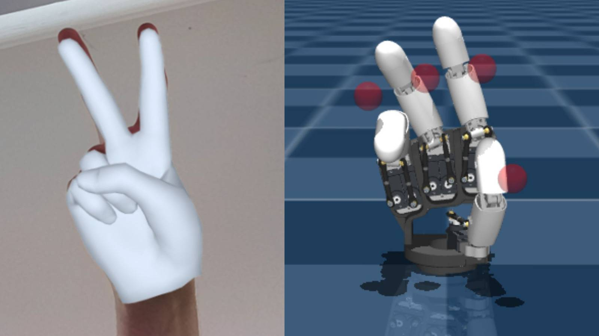
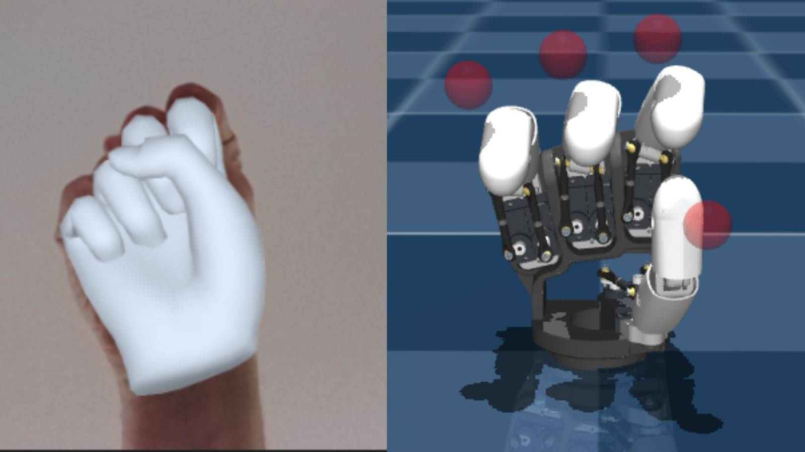
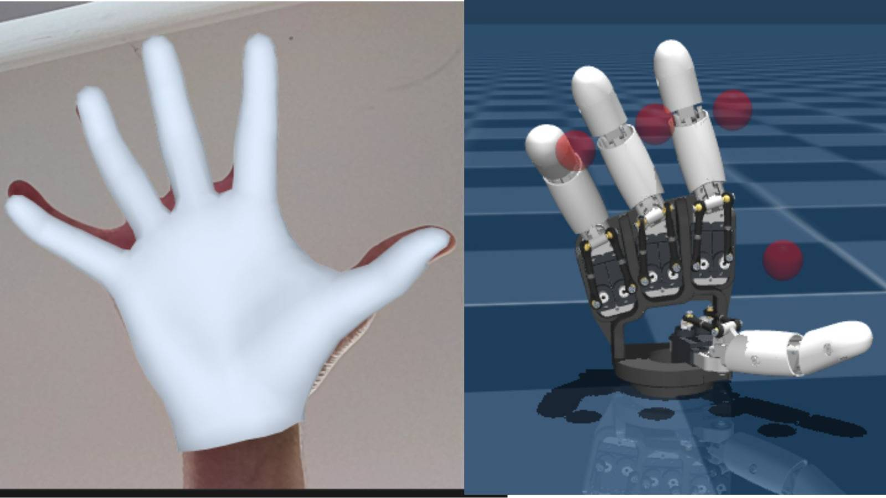

# Human Hand TSV → Amazing Hand Retargeting

> Real-time retargeting of human hand poses (from [HAMER](https://github.com/geopavlakos/hamer)) onto the [Pollen Robotics Amazing Hand](https://www.pollen-robotics.com/) 4-finger robot in MuJoCo.

---

## Overview

This pipeline takes **fingertip position vectors** produced by HAMER (a monocular 3D hand estimator) and converts them into **motor control signals** for the Amazing Hand robot. The retargeting runs in MuJoCo simulation with a passive 4-bar linkage robot model.
# hamer_to_amazing_hand

Retarget human hand poses estimated by [HAMER](https://github.com/geopavlakos/hamer) onto the [Amazing Hand](https://github.com/pollen-robotics) (Pollen Robotics, 4-finger 8-DoF) inside MuJoCo.

---

## Results

| Peace sign | Closed fist | Open hand |
|:---:|:---:|:---:|
|  |  |  |

Left: HAMER mesh overlay on human hand. Right: resulting robot pose in MuJoCo.

---

## How it works

HAMER outputs a `(5, 3)` TSV — five fingertip positions relative to the palm, one per finger (Thumb, Index, Middle, Ring, Pinky). This pipeline maps those to 8 motor angles on the Amazing Hand.

**Pipeline:**

1. **Coordinate remap** — HAMER uses a frame where fingers point in `−Y`; the robot uses `+Z`. Remapped as `human(X, Y, Z) → robot(X, Z, −Y)`.

2. **Auto-calibration** — At startup, each motor is swept to ±0.5 rad and the passive 4-bar linkage constraints are settled via physics (300 steps). This builds a per-finger Jacobian (tip sensitivity in m/rad) automatically from the model — no hardcoding.

3. **Retargeting** — Per finger:
   - **motor1 (flexion):** The remapped Z component (`= −human_Y`) encodes extension. Mapped through `[HUMAN_Z_MIN, HUMAN_Z_MAX]` with a power curve (`gamma=1.5`) to push curled fingers further closed, then inverted through the Jacobian to get motor angle.
   - **motor2 (abduction):** Human X component scaled by `HUMAN_X_MAX`. Kept deliberately small since the robot's abduction range is much less than a human hand.
   - **Thumb** is handled separately — thumb curl moves across the palm (X axis), not forward/back (Y axis), so `motor1 ← −human_X` and `motor2 ← human_Z_depth`.

4. **Simulation** — EMA-smoothed ctrl interpolation drives the hand through poses in the MuJoCo viewer.

---

## Files

```
hamer_to_amazing_hand/
├── retarget.py       # Main retargeting + MuJoCo viewer
├── probe_fk.py       # FK diagnostic: sweeps each motor and prints tip sensitivity
└── README.md
```

---

## Usage

```bash
# Single pose
python retarget.py --tsv_file tsv_file --model_path model_path

# Folder of poses (cycles through them in the viewer)
python retarget.py --tsv_folder tsv_folder --model_path model_path --hold_time 2.0

# Diagnose FK / motor sensitivity
python probe_fk.py model_path
```

### Tuning parameters

| Flag | Default | Effect |
|---|---|---|
| `--human_z_min` | `0.05` | Fully curled fingertip distance from palm (m). Raise to make fists tighter. |
| `--human_z_max` | `0.18` | Fully extended fingertip distance from palm (m). Lower for small hands. |
| `--human_x_max` | `0.60` | Lateral spread range (m). Raise to reduce sideways bending. |
| `--hold_time` | `2.0` | Seconds per pose in the viewer. |

---

## Dependencies

```bash
pip install numpy mujoco
```

Python 3.10+, MuJoCo 3.x.

---

## Finger mapping

The Amazing Hand has 4 fingers. Pinky is dropped.

| Human finger | Robot tip | Motors |
|---|---|---|
| Index  | tip1 | finger1_motor1, finger1_motor2 |
| Middle | tip2 | finger2_motor1, finger2_motor2 |
| Ring   | tip3 | finger3_motor1, finger3_motor2 |
| Thumb  | tip4 | finger4_motor1, finger4_motor2 |

---

## Notes

- The calibration Jacobian is linear (measured at 0.5 rad). Accuracy degrades slightly at large motor angles but is sufficient for retargeting.
- `HUMAN_Z_MIN` / `HUMAN_Z_MAX` are anatomical estimates for an average adult hand. For a different subject, run one open-hand and one fist pose first, read off the TSV Z values, and set the flags accordingly.
- The passive 4-bar linkage joints require physics settle steps to reach their constrained position. `mj_forward` alone is not sufficient — this was the original root cause of motors not moving in early versions.
```
Camera → HAMER → TSV (5×3 fingertip vectors) → retarget_tsv() → 8 motor ctrl values → MuJoCo viewer
```

The approach is inspired by [DexMV](https://yzqin.github.io/dexmv/) and [Robotic Telekinesis](https://robotic-telekinesis.github.io/), but uses a lightweight **Jacobian-based IK** rather than energy minimisation — making it fast enough for real-time use.

---

## Finger Mapping

The Amazing Hand has 4 fingers. HAMER outputs 5. The pinky is dropped; the remaining fingers map as:

| Human (HAMER) | Robot tip site | Motors |
|---|---|---|
| Index  (1) | `tip1` | `finger1_motor1`, `finger1_motor2` |
| Middle (2) | `tip2` | `finger2_motor1`, `finger2_motor2` |
| Ring   (3) | `tip3` | `finger3_motor1`, `finger3_motor2` |
| Thumb  (0) | `tip4` | `finger4_motor1`, `finger4_motor2` |
| Pinky  (4) | — | dropped |

---

## Motor Semantics

Each finger has two actuators, verified empirically by sweeping motors and measuring tip displacement in physics simulation:

| Motor | Role | Sign convention |
|---|---|---|
| `motor1` | **Flexion** (curl / extend) | `+` → curls toward palm · `−` → extends away |
| `motor2` | **Abduction** (lateral spread) | `+`/`−` → spreads sideways |

The dominant sensitivity axes (from auto-calibration):

- `motor1` drives primarily **Z** (`jac_m1_Z ≈ −0.034 m/rad`)
- `motor2` drives primarily **X** (`jac_m2_X ≈ −0.025 m/rad`)

Both motors are measured automatically at startup by sweeping `±0.5 rad` and settling 300 physics steps to let the passive 4-bar linkage constraints resolve.

---

## Mathematics

### 1. Coordinate Frame Remapping

HAMER outputs palm-relative fingertip vectors where **fingers point in −Y**. The robot's world frame has **fingers pointing in +Z**. A fixed remapping aligns them:

$$
\mathbf{v}_{\text{robot}} = \begin{bmatrix} v_x \\ v_z \\ -v_y \end{bmatrix}
\quad \text{from} \quad
\mathbf{v}_{\text{human}} = \begin{bmatrix} v_x \\ v_y \\ v_z \end{bmatrix}
$$

So `robot_Z = −human_Y` becomes the **extension signal** and `robot_X = human_X` becomes the **lateral spread signal**.

### 2. Auto-Calibration (Jacobian)

At startup, each motor is swept to `±CALIB_ANGLE = 0.5 rad` with 300 physics settle steps. The linear sensitivity per radian is recorded:

$$
\mathbf{J}_{i}^{m1} = \frac{\mathbf{t}_{i}(+\delta) - \mathbf{t}_{i}(-\delta)}{2\,\delta}
\quad \in \mathbb{R}^3
$$

where $\mathbf{t}_i$ is the palm-relative tip position of finger $i$ after settling. This also gives the **Z range** for each finger:

$$
z_{\text{curl},i} = z_{0,i} + J_{i,z}^{m1} \cdot \frac{\pi}{2}
\qquad
z_{\text{ext},i}  = z_{0,i} + J_{i,z}^{m1} \cdot \left(-\frac{\pi}{2}\right)
$$

### 3. Retargeting: Fingers 1–3

The human fingertip **Z component after remapping** is `−human_Y`, which measures how far the fingertip is from the palm along the finger axis. This is the primary **extension signal**.

**Step 1 — Normalise to extension ratio:**

$$
r = \text{clip}\!\left(\frac{z_{\text{human}} - z_{\text{min}}}{z_{\text{max}} - z_{\text{min}}},\ 0,\ 1\right)
$$

where `z_min = 0.05 m` (fully curled) and `z_max = 0.18 m` (fully extended).

**Step 2 — Apply power curve to emphasise curl:**

$$
r' = r^{\gamma}, \quad \gamma = 1.5
$$

$\gamma > 1$ compresses the middle of the range toward the curled end, so fingers in a fist reach full curl without over-extending the open hand.

**Step 3 — Map to robot Z range and invert through Jacobian:**

$$
z_{\text{target}} = z_{\text{curl},i} + r' \cdot (z_{\text{ext},i} - z_{\text{curl},i})
$$

$$
q_{m1} = \text{clip}\!\left(\frac{z_{\text{target}} - z_{0,i}}{J_{i,z}^{m1}},\ -\tfrac{\pi}{2},\ +\tfrac{\pi}{2}\right)
$$

**Step 4 — Abduction from lateral spread:**

$$
q_{m2} = \text{clip}\!\left(\frac{x_{\text{human}}}{x_{\text{max}}} \cdot \frac{\pi}{2},\ -\tfrac{\pi}{2},\ +\tfrac{\pi}{2}\right)
$$

`x_max = 0.60 m` is set conservatively large to prevent unrealistic sideways bending (the robot's abduction range is much smaller than a human hand).

### 4. Retargeting: Thumb (Finger 4)

The thumb has different anatomy. In a closed fist, the thumb **tucks across the palm** — this motion is captured in the **X component** of the HAMER vector, not Y:

| Pose | `human_X` | Meaning |
|---|---|---|
| Fist | −0.035 m | thumb tucked across palm |
| Peace | −0.055 m | thumb more tucked |
| Open | +0.098 m | thumb spread outward |

The thumb motor1 is therefore driven by X directly:

$$
q_{m1}^{\text{thumb}} = \text{clip}\!\left(-\frac{x_{\text{human}}}{x_{\text{thumb\_max}}} \cdot \frac{\pi}{2},\ -\tfrac{\pi}{2},\ +\tfrac{\pi}{2}\right)
$$

with `x_thumb_max = 0.10 m`. The sign negation means negative X (tucked) → positive m1 (curl).

A small depth correction from the raw HAMER Z drives thumb abduction:

$$
q_{m2}^{\text{thumb}} = \text{clip}\!\left(\frac{z_{\text{raw}}}{0.05} \cdot 0.4,\ -\tfrac{\pi}{2},\ +\tfrac{\pi}{2}\right)
$$

---

## Installation

```bash
pip install numpy mujoco
```

Python 3.10+ and MuJoCo 3.x required.

---

## Usage

### Single TSV file

```bash
python retarget.py --tsv_file tsv_file --model_path model_path
```

### Folder of TSV files (cycles through all poses)

```bash
python retarget.py --tsv_folder tsv_folder --model_path model_path --hold_time 3.0
```

### Demo mode (no TSV files needed)

```bash
python retarget.py --model_path model_path
```

---

## CLI Arguments

| Argument | Default | Description |
|---|---|---|
| `--model_path` | `mjcf/scene.xml` | Path to MuJoCo scene XML |
| `--tsv_file` | — | Single `.npy` TSV file |
| `--tsv_folder` | — | Folder containing `*_tsv.npy` files |
| `--hold_time` | `2.0` | Seconds to hold each pose in the viewer |
| `--human_z_max` | `0.18` | Max fingertip extension for your subject (metres) |
| `--human_z_min` | `0.05` | Min fingertip extension (fully curled) for your subject (metres) |

---

## Tuning for a New Subject

The three anatomical constants can be adjusted per subject without changing any code logic:

| Constant | Default | Effect |
|---|---|---|
| `HUMAN_Z_MIN` | `0.05 m` | Raise if fist doesn't close fully |
| `HUMAN_Z_MAX` | `0.18 m` | Lower if subject has short fingers and open hand under-extends |
| `HUMAN_X_MAX` | `0.60 m` | Lower for more pronounced lateral spread; raise to reduce sideways bending |
| `CURL_GAMMA`  | `1.5` | Raise for tighter curl response; `1.0` = linear |

For best results, have the subject perform a **fist** and an **open hand** and use those TSV values to set `Z_MIN` and `Z_MAX` automatically — this is equivalent to the subject calibration step in DexPilot and Robotic Telekinesis.

---

## TSV Format

Each `.npy` file contains a `(5, 3)` float array of palm-relative fingertip positions in **HAMER coordinate frame** (metres):

```
tsv[0] = Thumb   [X, Y, Z]
tsv[1] = Index   [X, Y, Z]
tsv[2] = Middle  [X, Y, Z]
tsv[3] = Ring    [X, Y, Z]
tsv[4] = Pinky   [X, Y, Z]  ← dropped, not used
```

In HAMER's frame, **fingers point in −Y** from the palm. `|tsv[i]|` (vector length) encodes extension: short = curled, long = extended.

---

## Architecture

```
retarget.py
│
├── calibrate()          # Auto-measures Jacobian + Z ranges at startup
│   ├── settle()         # Resets sim, applies ctrl, runs N physics steps
│   └── get_tip_vecs()   # Reads palm-relative tip positions
│
├── retarget_tsv()       # Core retargeting: TSV (5,3) → ctrl (8,)
│   ├── remap()          # Coordinate frame: HAMER → robot
│   ├── Fingers 1-3      # Z-based flexion with gamma curve + X abduction
│   └── Thumb            # X-based flexion (crosses palm) + Z depth
│
└── run_simulation()     # Loads model, calibrates, retargets, launches viewer
```

---

## Design Decisions

**Why not scipy.optimize?**
Energy minimisation requires hundreds of physics settle steps per evaluation (the passive 4-bar linkage cannot use `mj_forward` alone — constraints only resolve via `mj_step`). At ~300 steps per FK call and ~100 optimizer iterations, a single pose takes ~30 000 physics steps. The direct Jacobian mapping solves each pose in microseconds with comparable accuracy.

**Why separate thumb logic?**
The thumb's primary curl motion (tucking across the palm in a fist) moves in the hand's X axis, not Y. Driving thumb `motor1` from the Y signal as with other fingers produces virtually no movement across common poses. Using X as the primary signal correctly distinguishes fist, peace, and open hand.

**Why a power curve (CURL_GAMMA)?**
A linear mapping from human Z to motor angle leaves fist poses under-curled because even a fully closed fist has fingertips ~4–7 cm from the palm (not 0 cm). The power curve `r^γ` compresses mid-range values toward full curl without affecting the fully-extended end, giving a tighter fist without making the open hand look curled.

---

## References

- Pavlakos et al., *Reconstructing Hands in 3D with Transformers* (HAMER), CVPR 2024
- Qin et al., *DexMV: Imitation Learning for Dexterous Manipulation from Human Videos*, ECCV 2022
- Sivakumar et al., *Robotic Telekinesis: Learning a Robotic Hand Imitator by Watching Humans on YouTube*, RSS 2022
- Handa et al., *DexPilot: Vision-Based Teleoperation of Dexterous Robotic Hand-Arm System*, ICRA 2020